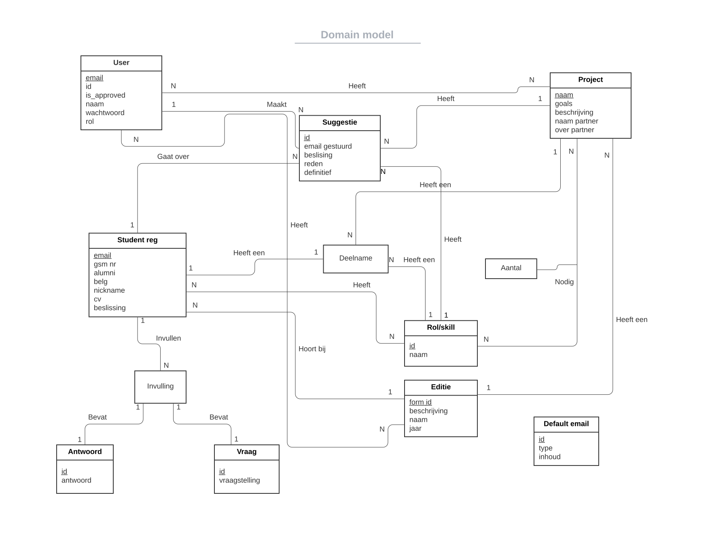

# User manual for OSOC Selection tool 
#### [1. Introduction](#1-introduction-1)
#### [2. Product information](#2-product-information-1)
#### [3. Intended use](#3-intended-use-1)
#### [4. Installation guide](#4-installation-guide-1)

[4.1. Configuration](#41-configuration)\
[4.2. Requirements](#42-requirements) \
[4.3. Local installation](#43-local-installation) \
[4.4. Automatic deployment](#44-automatic-deployment)

#### [5. How to further develop & test](#5-howt-to-further-development--test-1)

#### [6. Architecture and Design](#6-architecture-and-design-1)

#### [7. Description of the main product elements](#7-description-of-the-main-product-elements-1)

[7.1. Domain Model](#71-domain-model) \
[7.1.1. User](#711-user) \
[7.1.2. Project](#712-project) \
[7.1.3. Edition](#713-edition) \
[7.1.4. Skill](#714-skill) \
[7.1.5. Question](#715-question) \
[7.1.6. Answer](#716-answer) \
[7.1.7. QuestionAnswer](#717-questionanswer) \
[7.1.8. Student](#718-student) \
[7.1.9. Suggestion](#719-suggestion) \
[7.1.10. Participation](#7110-participation) \
[7.1.11. Default_email](#7111-default_email)

#### [8. Description of the user interface and common use cases](#8-description-of-the-user-interface-and-common-use-cases-1)

[8.1. Login screen](#81-login-screen)


## 1. Introduction
In this manual we'll explain everything there is to explain about the OSOC selection tool we've created. Going from installation and configuration, to usage of the selection tool. And we'll even go as far as showing you how to further develop this tool.


## 2. Product information
This manual concerns the Open Summer Of Code Selection tool, version 2.


## 3. Intended use
The tool is intended to be (and made to be) used by the selection-team of OSOC. With this we mean the people of OSOC itself that will supervise and conduct the selection-process (they are intended to be admins within our tool). And the people that will help the selection process by suggesting students (the coaches). These coaches will have to be invited every year, as these people mostly differ from edition to edition. 


## 4. Installation guide

### 4.1. Configuration
While developing or before installing you can use your own environment variables by using a .env file in the backend directory of the application. It should look like this:
```
# Mongo
MONGO_URL=192.168.0.102
MONGO_PORT=27017
MONGO_USER=root
MONGO_PASSWORD=justapassword

# Redis
REDIS_URL=192.168.0.102
REDIS_PORT=6379
REDIS_PASSWORD=justapassword

# SMTP Mail
SMTP_SERVER=smtp.gmail.com
SMTP_SSL_PORT=465
SENDER_EMAIL=osoc.groep4@gmail.com
SENDER_PASSWORD=Justapassword123!

# Invite Settings
INVITE_EXPIRE=4320 # in minutes
PASSWORDRESET_EXPIRE=30 # in minutes
```

### 4.2. Requirements
- Docker (installation guide: https://docs.docker.com/get-docker/)
- Docker Compose (installation guide: https://docs.docker.com/compose/install/)

If you want to run docker without sudo, we recommend you check here: https://docs.docker.com/engine/install/linux-postinstall/

### 4.3. Local installation

You first need to clone the repository that contains the code for the selection tool:

_with SSH, recommended_
```
git clone git@github.com:SELab-2/OSOC-4.git OSOC-selection-tool
cd OSOC-selection-tool
```

_with HTTPS_
```
git clone https://github.com/SELab-2/OSOC-4.git OSOC-selection-tool
cd OSOC-selection-tool
```

Now you need to start the application:
```
docker-compose up -d --build
```

If you want to restart all services you can use:
```
docker-compose restart
```

If you only want to restart one service, use one of the following commands:

`docker restart osoc-backend`

`docker restart osoc-mongodb`

`docker restart osoc-redis`

`docker restart osoc-frontend`

If you want to stop all services you can use
```
docker-compose down
```

### 4.4. Automatic deployment
Github Actions are used to automatically deploy the new codebase from the master or development branch to the server. A seperate docker-compose file is used by the Github Actions to deploy the application to the production server. This docker-compose file is made so the frontend and backend use the correct paths. This is needed because subdomains can't be used in the UGent network. Instead we use an extra prefixpath (/frontend and /api).

These branch versions of the application can be accessed by:
```
frontend: https://sel2-4.ugent.be/{branchname}/frontend
backend-api: https://sel2-4.ugent.be/{branchname}/api
```


## 5. How to further develop & test
Tests will run automatically with github actions but can be run locally too. There is a seperate docker-compose file for the test containers so they won't interfere with the running containers for the development or production. The containers used for testing don't map there ports to the host machine so they can't be accessed by the internet for security.

```
docker-compose -f test-docker-compose.yml up --build -d # this starts the test database and test redis server
docker-compose -f test-docker-compose.yml run test-osoc-backend python -m unittest discover # This executes the python -m ... command in the backend container
docker-compose down  # this stops the container again
```


## 6. Architecture and Design
Now we're going to describe the architecture and design of the OSOC selection tool.

In order to deploy everything, we use Docker. Using containers allows us to have
an easily reproducible deployment. We have a seperate container for the
database (PostgreSQL), the Redis, the backend (FastAPI) and the frontend (Next.js). This allows us to develop and scale
each part of our application separately.


The design of our application is a very standard client-server architecture. A frontend is
used to access a backend, both of which are deployed on a server (as shown above). The frontend is
accessed through a reverse proxy. This is provided through Traefik. Traefik also
provides a dashboard that allows us to monitor all the services.


The backend can then access data, which is stored using PostgreSQL and Redis.
Redis has built in features to let data automaticaly expire and is thus used
for user invites, password resets and revokable tokens. PostgreSQL is used for
everything else. This way the frontend doesn't have direct access to the
database, all operations on the database are defined and controlled by the backend.


## 7. Description of the main product elements

### 7.1. Domain model


Now folows a description of each element in the domain model.


#### 7.1.1. User
A user is a person who has an account on the tool, or is in the progress of getting an account.

Now follows an in depth description of the attributes of a user.

_attributes:_ \
**id**: the id of the user, only used internally and unique for each user \
**email**: the email address of the user, this is unique for each user \
**name**: the name of the user, two or more users with the same name may exist \
**password**: the password of the user, this will be saved in the database, hashed and salted for security reasons \
**role**: there are 2 types of roles: coaches and admins, admins can do anything any coach can do and more \
**role: coach**: ... \
**role: admin**: can do anything any coach can do \
**status: is_active, is_approved, is_disabled**: a user can either be active, approved, disabled or nothing \
**satus: nothing** (all are set false): the user has been created and an invite has been send to that user \
**status: active**: the user has set a name and password by using the invite link. \
**status: approved**: the user was active, and an admin has approved the user (the user now has acces to the tool) \
**status: disabled**: the user does not take part in the current edition and therefore shouldn't have acces to the tool, he is disabled


#### 7.1.2. Project
Represents a project that will be made by OSOC students, given by a partner. A project will also contain the the information of the partner.

Now follows an in depth description of the attributes of a project.

_attributes:_ \
**id**: the id of the project, only used internally and unique for each project \
**name**: the name of the project \
**description**: the description of the project \
**goals**: the goals of the project, this is a list of goals (strings/text) that should be all be archieved at the end of the project \
**partner**: the partner ordering the project. This consists of two more fields. In the database we do not store these two fields seperatily \
**partner: name**: the name of the partner \
**partner: about**: additional information about the partner \
**required_skills**: a list of requiredSkills, this consists of two fields \
**requiredSKills: skill_id**: the id of the skill that is needed \
**requiredSKills: amount**: the amount of students, with this skill, that are required for this project.

_attributes defining a relationship:_ \
**users**: a list of user id's, these are the users which are assigned to this project \
**edition**: the id of the edition this project belongs to


#### 7.1.3. Edition
An edition of Open Summer Of Code

Now follows an in depth description of the attributes of an edition.

_attributes:_ \
**id**: the id of the edition, only used internally and unique for each edition \
**year**: the year in which the edition took place, this is unique for each edition \
**name**: the name of the edition. (like "OSOC 2022 edition") \
**Description**: the description of the edition. (like startdate and enddate, or brief overview of the partners, ...) \
**form_id**: the id of the tally form for this year's edition. Notice that multiple years can use the same tally form

_attributes defining a relationship:_ \
**user_ids**: a list of id's from the users that belong to this edition


#### 7.1.4. Skill
A skill like ux-designer, backend-developper, communications-manager.

Now follows an in depth description of the attributes of a skill.

_attributes:_ \
**id**: the id of the skill, only used internally and unique for each skill \
**name**: the name of the skill. (like ux-designer, backend developer, ...)


#### 7.1.5. Question
A question from the tally form that students are supposed to fill in

Now follows an in depth description of the attributes of a question.

_attributes:_ \
**id**: the id of the question, only used internally and unique for each question \
**tally_id**: the id of the question assigned by tally \
**question**: the question itself
**type**: the type of question


#### 7.1.6. Answer
An anwser from the tally form that a student filled in.

Now follows an in depth description of the attributes of an answer.

_attributes:_ \
**id**: the id of the answer, only used internally and unique for each answer \
**tally_id**: the id of the answer assigned by tally \
**answer**: the answer itself


#### 7.1.7. QuestionAnswer
A combination of a question and an answer that a student made.

Now follows an in depth description of the attributes of a question-answer.

_attributes:_ \
**id**: the id of the question-answer, only used internally and unique for each answer \

_attributes defining a relationship:_ \
**question**: the id of the question \
**answer**: the id of the answer


#### 7.1.8. Student
A student, a representation of the tally form they filled out with the most basic info about them. 

Now follows an in depth description of the attributes of a student.

_attributes:_ \
**id**: the id of the student, only used internally and unique for each student \
**email**: the email address of the student \
**name**: the name of the student \
**nickname**: the nickname of the student \
**phone_number**: the phone number of the student \
**alumn**: whether the student has already participated in an edition of OSOC. \
**cv**: a link to the students' cv

_attributes defining a relationship:_ \
**question_answers**: a list of questions-answers ids, the questions and answers which the student filled in \
**skills**: a list of skills (represented by their id's) which the student has \
**edition**: the edition in which the student filled in the form \


#### 7.1.9. Suggestion
A suggestion that a coach makes about a student, or a decision from an administrator.

Now follows an in depth description of the attributes of a suggestion.

_attributes:_ \
**id**: the id of a suggestion, only used internally and unique for each student \
**email_sent**: Has the student received an email of the decision, only relevant if the suggestion is a decision \
**decision**: Yes / No / Maybe \
**definitive**: true if this suggestion represents a decision, otherwise it represents a suggestion \
**reason**: the reason that the coach/administrator gives with the suggestion

_attributes defining a relationship:_ \
**student**: the student which the suggestion is about \
**suggested_by**: the user who made the suggestion \
**project**: the project which is suggested, optional attribute \
**skill**: the skill which is suggested, optional attribute

#### 7.1.10. Participation
Defines a ternair relationship which is converted to an entity itself. It describes what student will take on what role in what project. 

Now follows an in depth description of the attributes of a participation.

_attributes defining a relationship:_ \
**student**: the id of the student who will participate \
**project**: the id of the project in which the student will participate \
**skill**: the role (thus the skill the student has and will use) the student will take on in the project \


#### 7.1.11. Default_email
Default emails are stored in the database.

Now follows an in depth description of the attributes of a default email.

_attributes:_ \
**id**: the id of a default email, only used internally and unique for each default email \
**type**: the type of a default email, for example yes, maybe, no, invite \
**content**: the content of the default email


First of all we have a login system. If you already have an account on the tool (see the next section 'invite system' if you want to know how to obtain an account), you need to provide your email-adress and password in order to login. There is no support yet for github, but that will be added in a later version. There also is no 2FA, but it may be added in later versions.


## 8. Description of the user interface and common use cases

### 8.1. Login screen


Before logging in, your profile must be approved by an admin.
1. A field to write your email address that is linked to your profile.
2. A field to write your password to enter the application.
3. This button will give you access to the application if the email address and password match a valid profile. Otherwise, you will get a warning message.
4. If you forgot your password, this button will send you an email to reset your password.

