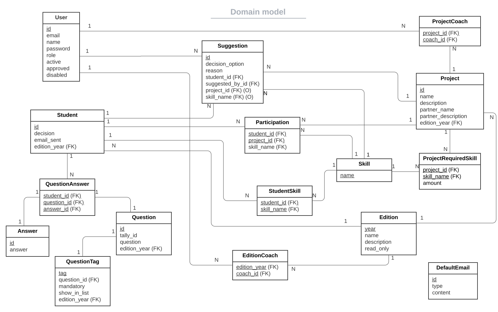
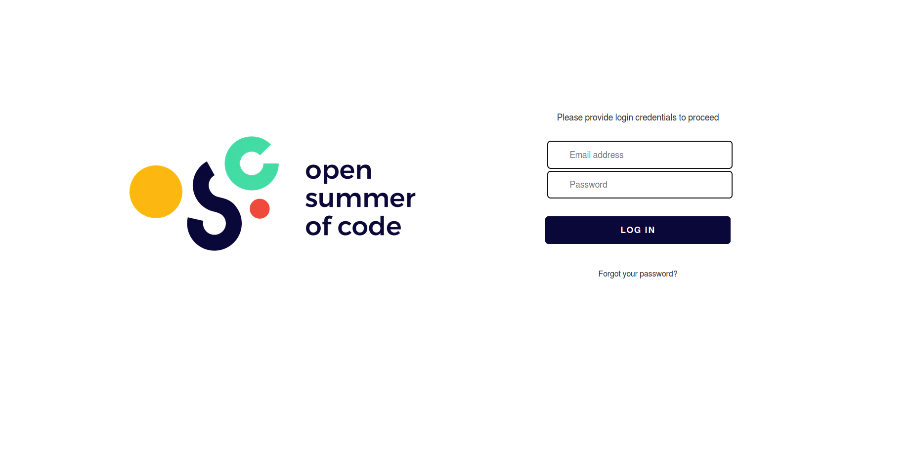
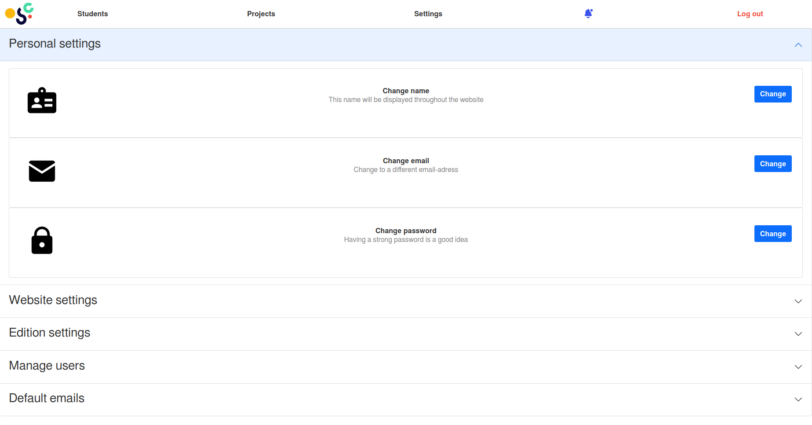
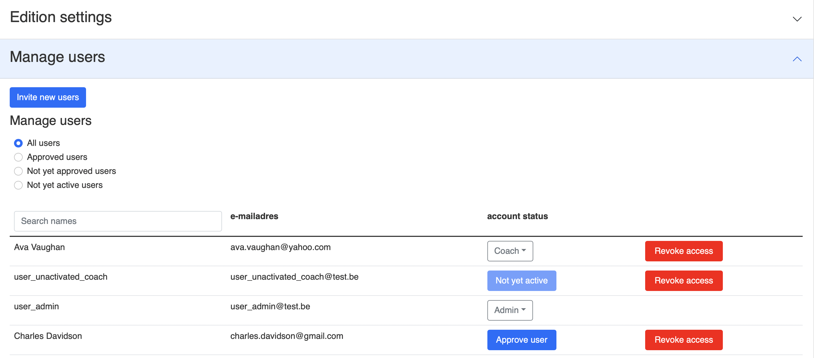

# User manual for OSOC Selection tool 
#### [1. Introduction](#1-introduction-1)
#### [2. Product information](#2-product-information-1)
#### [3. Intended use](#3-intended-use-1)
#### [4. Installation guide](#4-installation-guide-1)

[4.1. Configuration](#41-configuration)\
[4.2. Requirements](#42-requirements) \
[4.3. Local installation](#43-local-installation) \
[4.4. Automatic deployment](#44-automatic-deployment)

#### [5. How to further develop & test](#5-how-to-further-develop--test-1)

[5.1. Further development](#51-further-development) \
[5.2. Testing](#52-testing)

#### [6. Architecture and Design](#6-architecture-and-design-1)

[6.1. Architecture and Design](#61-architecture-and-design) \
[6.2. Directory structure](#62-directory-structure)

#### [7. Description of the main product elements](#7-description-of-the-main-product-elements-1)

[7.1. Domain Model](#71-domain-model) \
[7.1.1. Edition](#711-edition) \
[7.1.2. User](#712-user) \
[7.1.3. EditionCoach](#713-editioncoach) \
[7.1.4. Student](#714-student) \
[7.1.5. QuestionAnswer](#715-questionanswer) \
[7.1.6. Answer](#716-answer) \
[7.1.7. Question](#717-question) \
[7.1.8. QuestionTag](#718-questiontag) \
[7.1.9. Skill](#719-skill) \
[7.1.10. StudentSkill](#7110-studentskill) \
[7.1.11. Project](#7111-project) \
[7.1.12. ProjectRequiredSkill](#7112-projectrequiredskill) \
[7.1.13. ProjectCoach](#7113-projectcoach) \
[7.1.14. Suggestion](#7114-suggestion) \
[7.1.15. Participation](#7115-participation) \
[7.1.16. DefaultEmail](#7116-defaultemail)

#### [8. Interactions and use cases](#8-interactions-and-use-cases-1)

[8.1. Interaction diagram](#81-interaction-diagram) \
[8.2. Logging in](#82-logging-in) \
[8.3. The navigation bar](#83-the-navigation-bar) \
[8.4. The settings](#84-the-settings) \
[8.4.1. Personal settings](#841-personal-settings) \
[8.4.2. Edition settings](#842-edition-settings) \
[8.4.3. Manage users](#843-manage-users)


## 1. Introduction
In this manual we'll explain everything there is to explain about the OSOC selection tool we've created. Going from installation and configuration, to usage of the selection tool. And we'll even go as far as showing you how to further develop this tool.


## 2. Product information
This manual concerns the Open Summer Of Code Selection tool, version 2.


## 3. Intended use
The tool is intended to be (and made to be) used by the selection-team of OSOC. With this we mean the people of OSOC itself that will supervise and conduct the selection-process (they are intended to be admins within our tool). And the people that will help the selection process by suggesting students (the coaches). These coaches will have to be invited every year, as these people mostly differ from edition to edition. 


## 4. Installation guide

### 4.1. Configuration
While developing or before installing you can use your own environment variables by using a .env file in the backend and/or frontend directory of the application. 

An example .env file for the backend directory of the application (IP-addresses may need to be changed):
```
# Mongo
MONGO_URL=192.168.0.102
MONGO_PORT=27017
MONGO_USER=root
MONGO_PASSWORD=justapassword

# Redis
REDIS_URL=192.168.0.102
REDIS_PORT=6379
REDIS_PASSWORD=justapassword

# SMTP Mail
SMTP_SERVER=smtp.gmail.com
SMTP_SSL_PORT=465
SENDER_EMAIL=osoc.groep4@gmail.com
SENDER_PASSWORD=Justapassword123!

# Invite Settings
INVITE_EXPIRE=4320 # in minutes
PASSWORDRESET_EXPIRE=30 # in minutes

# Testing
TEST_EMAIL=osoc.groep4+test@gmail.com
```

An example .env file for the frontend directory of the application:
```
NEXT_BASE_PATH=""
NEXTAUTH_URL="http://127.0.0.1:3000/api/auth"
NEXT_API_URL="http://127.0.0.1:8000"
NEXT_INTERNAL_API_URL="http://127.0.0.1:8000"
NODE_ENV="development"  # or production
```


### 4.2. Requirements
- Docker (installation guide: https://docs.docker.com/get-docker/)
- Docker Compose (installation guide: https://docs.docker.com/compose/install/)

If you want to run docker without sudo, we recommend you check here: https://docs.docker.com/engine/install/linux-postinstall/

### 4.3. Local installation

You first need to clone the repository that contains the code for the selection tool:

_with SSH, recommended_
```
git clone git@github.com:SELab-2/OSOC-4.git OSOC-selection-tool
cd OSOC-selection-tool
```

_with HTTPS_
```
git clone https://github.com/SELab-2/OSOC-4.git OSOC-selection-tool
cd OSOC-selection-tool
```

Now you need to start the application:
```
docker-compose up -d --build
```

If you want to restart all services you can use:
```
docker-compose restart
```

If you only want to restart one service, use one of the following commands:

`docker restart osoc-backend`

`docker restart osoc-mongodb`

`docker restart osoc-redis`

`docker restart osoc-frontend`

If you want to stop all services you can use
```
docker-compose down
```

### 4.4. Automatic deployment
Github Actions are used to automatically deploy the new codebase from the master or development branch to the server. A seperate docker-compose file is used by the Github Actions to deploy the application to the production server. This docker-compose file is made so the frontend and backend use the correct paths. This is needed because subdomains can't be used in the UGent network. Instead we use an extra prefixpath (/frontend and /api).

These branch versions of the application can be accessed by:
```
frontend: https://sel2-4.ugent.be/{branchname}/frontend
backend-api: https://sel2-4.ugent.be/{branchname}/api
```


## 5. How to further develop & test

### 5.1. Further development

You can find the Swagger API docs on `http://localhost:8000/docs` (change the port if needed). These docs describe what requests you can make to the API (backend), and what type of body the request expects (if a body is needed for that request).

If find yourself in doubt where to find something, take a look at the [directory structure](#62-directory-structure).

### 5.2. Testing

(Backend) Tests will run automatically with github actions but can be run locally too. There is a seperate docker-compose file for the test containers so they won't interfere with the running containers for the development or production. The containers used for testing don't map there ports to the host machine so they can't be accessed by the internet for security.

#### 5.2.1 Backend tests

Run backend (API) tests:
```
docker-compose -f test-docker-compose.yml up --build -d # this starts the test database and test redis server
docker-compose -f test-docker-compose.yml run test-osoc-backend python -m unittest discover # This executes the python -m ... command in the backend container
docker-compose down  # this stops the container again
```

#### 5.2.2 Frontend tests

Unit tests can be run once using the command `yarn test`. If you want to run tests in watch mode or want more detailed output use `yarn test_watch` or `yarn test --watch-all --verbose`.

Integration tests can be run using `yarn cypress:headless` or with `yarn cypress` if you want a gui with more details.


## 6. Architecture and Design

### 6.1 Architecture and Design
Now we're going to describe the architecture and design of the OSOC selection tool.

In order to deploy everything, we use Docker. Using containers allows us to have
an easily reproducible deployment. We have a seperate container for the
database (PostgreSQL), the Redis, the backend (FastAPI) and the frontend (Next.js). This allows us to develop and scale
each part of our application separately.


The design of our application is a very standard client-server architecture. A frontend is
used to access a backend, both of which are deployed on a server (as shown above). The frontend is
accessed through a reverse proxy. This is provided through Traefik. Traefik also
provides a dashboard that allows us to monitor all the services.


The backend can then access data, which is stored using PostgreSQL and Redis.
Redis has built in features to let data automaticaly expire and is thus used
for user invites, password resets and revokable tokens. PostgreSQL is used for
everything else. This way the frontend doesn't have direct access to the
database, all operations on the database are defined and controlled by the backend.

Something noticable is that the frontend can send back to the reverse proxy (which will only go to the backend) but it can also send requests straight to the backend. This is because of Next.js. Next.js offers multiple ways to render pages, one is just normal client side rendering and the other we use is server side rendering. With client side rendering the requests will need to go through the proxy (Traefik). But when server side rendering is used for a page (there aren't many pages that use this since almost everything needs to update at real time), the request goes straight from the frontend to the backend, thereby skipping the proxy.


### 6.2. Directory structure
Now follows a description of the directory structure we use
```
OSOC-selection-tool/                   root of the repository   
├── LICENSE                            license (MIT)
├── docker-compose.yml                 docker-compose file for local deployment with env variables
├── deploy-docker-compose.yml          docker-compose file for deployment on our server
├── test-docker-compose.yml            docker-compose file to run tests
├── backend                            directory containing the backend of the application (the API build with FastAPI)
│   ├── requirements.txt               requirements (packages needed to install, the docker will install these)
│   ├── Dockerfile                     dockerfile for the API (uses requirements.txt)
|   ├── TestDockerfile                 dockerfile to run tests
│   └── app                            directory with the code for the API
│       ├── api.py                     starts up the API
│       ├── config.py                  configures the urls
│       ├── crud.py                    operations that the API makes to the database
│       ├── database.py                code to start & connect to the database (PostgreSQL and Redis)
│       ├── exceptions                 directory containing all exceptions that can be thrown
│       ├── models                     directory containing the database models
│       ├── routers                    directory containing all the routing functionality, this directory handles all API calls
│       ├── tests                      directory containing the tests for the API
│       └── utils                      directory containing the utils for the API
├── data                               directory where PostgreSQL and Redis store their data
│   ├── postgres                       PostgreSQL data
│   └── redis                          Redis data
├── frontend_nextjs                    directory containing the frontend of the application (Next.js)
│   ├── Dockerfile                     dockerfile for the frontend
│   ├── Components                     directory containing all components used to build pages
│   ├── pages                          directory containing all pages (if a page has the name "settings.js" then "/settings" will be a route
│   ├── public                         
│   │   └── assets                     directory containing all images used in the frontend
│   ├── styles                         directory containing all css files for the frontend
│   ├── tests                          directory containing the tests for the frontend
│   └── utils                          directory containing the utils for the frontend
│       ├── ApiClient.js               code that handles requests to the api
│       ├── logger.js                  code that handles logs, logs will only be printed when NODE_ENV="development" has been set (environment variable)
│       └── WindowDimensions.js
└── info                               directory containing information about the project/application
    ├── domain_model.svg               the domain model
    ├── architecture_and_design        images about the architecture and the design of the application
    ├── use-cases                      the usecases of the application
    ├── interaction_diagrams           diagrams explaining how certain interactions work 
    ├── screenshots                    screenshot of the frontend, used in user manual to to explain how to to certain tasks
    └── user_manual.md                 the user manual
```


## 7. Description of the main product elements

### 7.1. Domain model


Now folows a description of each element in the domain model.


#### 7.1.1. Edition
An edition of Open Summer Of Code.

_attributes:_ \
**year**: the year in which the edition took place, primary key \
**name**: the name of the edition. (like "OSOC 2022 edition") \
**Description**: the description of the edition. (like startdate and enddate, or brief overview of the partners, ...) \
**read_only**: whether the edition is read_only


#### 7.1.2. User
A user is a person who has an account on the tool, or is in the progress of getting an account.

_attributes:_ \
**id**: the id of the user, primary key \
**email**: the email address of the user, unique \
**name**: the name of the user, two or more users with the same name may exist \
**password**: the password of the user, this will be saved in the database, hashed and salted for security reasons \
**role**: there are 2 types of roles: coaches and admins, admins can do anything any coach can do and more \
**active, approved, disabled**: a user can either be active, approved, disabled or nothing \
**satus: nothing** (all of the above are set to false): the user exists \
**status: active**: the user has set a name and password by using the invite link \
**status: approved**: the user was active, and an admin has approved the user (the user now has acces to the tool) \
**status: disabled**: the user has been deleted from the tool, this is a soft delete so that we can still see actions the user made in the (previous) edition

#### 7.1.3. EditionCoach
A coach (user) that belongs to an edition.

_attributes:_ \
**edition_year (FK)**: the year of the edition, primary key \
**coach_id (FK)**: the id of the coach, primary key

#### 7.1.4 Student
A student, a representation of the tally form a student filled out with the info about them. 

_attributes:_ \
**id**: the id of the student, primary key \
**decision**: the decison (yes/maybe/no) that an admin gave to the student \
**email_sent**: whether an email has been send \
**edition_year (FK)**: the year of the edition when the student filled in the form

#### 7.1.5. QuestionAnswer
A combination of a question and an answer that a student made.

_attributes:_ \
**student_id (FK)**: the id of the student, primary key \
**question_id (FK)**: the id of the question, primary key \
**answer_id (FK)**: the id of the answer, primary key

#### 7.1.6. Answer
An anwser to a question of the tally form.

_attributes:_ \
**id**: the id of the answer, primary key \
**answer**: the answer itself

#### 7.1.7. Question
A question from the tally form.

_attributes:_ \
**id**: the id of the question, only used internally and unique for each question \
**tally_id**: the id of the question assigned by tally \
**question**: the question itself \
**edition_year (FK)**: the edition year in which the question was asked

#### 7.1.8. QuestionTag
A tag for a question from the tally form. The tag gives a meaning to the question, for example the question "What is your first name?" can be linked to the tag "first name", this way the tool knows that the answer to that question is the first name of the student.

_attributes:_ \
**tag**: the tag (the meaning) of the question, primary key \
**question_id (FK)**: the id of the question for which the tag is \
**mandatory**: whether the tag is mandatory to be defined in every edition \
**show_in_list**: whether the tag (and answer) should be visible in the list of students \
**edition_year (FK)**: the year of the edition the tag belongs to

#### 7.1.9. Skill
A skill like ux-designer, backend-developper, communications-manager.

_attributes:_ \
**name**: the name of the skill, primary key (like ux-designer, backend developer, ...)

#### 7.1.10. StudentSkill
A student that has a specific skill.

_attributes:_ \
**student_id (FK)**: the id of the student who has the skill, primary key \
**skill_name (FK)**: the name of the skill, primary key

#### 7.1.11. Project
Represents a project that will be made by OSOC students for a partner. A project will also contain the the information of that partner.

_attributes:_ \
**id**: the id of the project, primary key \
**name**: the name of the project \
**description**: the description of the project \
**partner_name**: the name of the partner \
**partner_description**: additional information about the partner \
**edition_year (FK)**: the year of the edition the project belongs to

#### 7.1.12. ProjectRequiredSkill
A skill that a project needs, and how many times it needs a student that has that skill.

_attributes:_ \
**project_id**: the id of the project, primary key, foreign key \
**skill_name (FK)**: the name of the skill that is required, primary key \
**amount**: the amount of students with that skill that are required

#### 7.1.13. ProjectCoach
A coach that coaches for a project.

_attributes:_ \
**project_id (FK)**: the id of the project, primary key \
**coach_id (FK)**: the id of the coach (user), primary key

#### 7.1.14. Suggestion
A suggestion that a coach makes about a student, or a decision from an administrator.

_attributes:_ \
**id**: the id of a suggestion, only used internally and unique for each student \
**decision_option**: Yes / No / Maybe \
**reason**: the reason that the coach/administrator gives with the suggestion \
**student_id (FK)**: the id of the student for which the suggestion made \
**suggested_by_id (FK)**: the id of the coach (user) who made the suggestion \
**project_id (FK)**: the id of the project for which is suggested, optional attribute \
**skill_name (FK)**: the name of the skill which is suggested, optional attribute

#### 7.1.15. Participation
Which student will take on what role in what project.

_attributes defining a relationship:_ \
**studen_id (FK)**: the id of the student who will participate \
**project_id (FK)**: the id of the project in which the student will participate \
**skill_name (FK)**: the name of the skill (thus the skill the student has and will use) the student will take on in the project

#### 7.1.16. DefaultEmail
Default emails are stored in the database.

_attributes:_ \
**id**: the id of a default email, primary key \
**type**: the type of the default email, for example yes, maybe, no \
**content**: the content of the default email


## 8. Interactions and use cases

### 8.1. Interaction diagram
All actions a user can do on our application, can be described by one diagram (shown below). It comes down to this: a user does an interaction with the website (frontend), this interaction is either immediately handled by the frontend (for example typing a letter in a text field) and is thus immediately visualized. Or the interaction transforms into a request to the API. The API will then receive and process the request, which might use some data from either of both databases, and respond with either a successful response, or an exception. The frontend will receive this response, and react upon it (visualize it to the user).


Every interaction described below will use some parts (or all parts) of this diagram. We won't repeat this diagram for every interaction, but we'll show you an example for the log in interaction described in the next section.


### 8.2. Logging in
When you first visit the application, you have to log in. This requires the guest to type in his credentials (email address and password) and click on the login button. The login screen looks like this:



The application (or website, or frontend) will then send a POST request to the API (backend), which will validate if you've given the email address of a user that exists, and that the passwords match. If so the backend also checks whether the user is allowed access (for example an admin might not have approved the user yet). If something went wrong then the API will respond with an error, which the guest will see on the login webpage. If on the other hand the login was succesful, then the guest will become a user (Coach or Admin) and will be redirected to the dashboard (main-page or index) of the application. The interaction is also described in the diagram below. As you can see we didn't need the Redis for this interaction.


### 8.3. Navigating the application
The navigation bar, probably the most important part of any website. If you're logged in, the navigation bar will always be shown at the top of the page, no mather what page you're currently viewing. This component is used to switch between pages, for example if you click on the `select-students` text (this is a link), you will be redirected to the select-students page. The same goes for `projects` which bring you to the projects page and for `settings` which brings you to the settings page. If you wish to go back to the `dashboard` (the main page, the page you view after having logged in), you can click on the image / logo all the way on the left. If you wish to log out, you can simply click on the `Log out` text all the way on the right. Keep in mind that when you're logged out you won't see the navigation bar, as you're not allowed to navigate the application (you must be logged in for that).


Clicking on any of these links will require some requests to the API as new data needs to be loaded.

### 8.4. Configuring settings
The settings page, the place to configure (almost) everything! The page consists of multiple categories you can click on and will then open up to reveal the settings for that category. 

#### 8.4.1. Personal settings
By default when you arrive on the settings page, the category `personal settings` will be revealed, in here you can change you personal information like your name, email address and password. For each of these sub-categories you can find a button on the right that says "change" which opens up a window where you can change the chosen setting.



#### 8.4.2. Changing the selected edition & configuring the current edition
You'll only see these settings if you are an admin.

If you click on the `Edition settings` you'll see the title of the current (selected) edition, with underneath the description. Below that you'll see 3 more settings sub-categories that can be clicked on to open. \
`Change edition` shows a dropdown where you can select another edition to view, this way you can see the students & projects from another edition (keep in mind that old editions will be read-only).


If you click on `Question tags` you'll see a list of the question tags for this edition. In here you can change the name of the tag (if the tag is not mandatory) and the question that the tag corresponds to (click the pencil button on the right). You can also check the checkbox to show the tag and answer to the question in the list of students on the students tab and projects tab. If you think a tag is unnecessary, you can delete it if the tag isn't mandatory.


If you click on `Create new edition` you'll see a form that you can fill in in order to create the new edition. You'll need to provide the year, name and description of the new edition, and then press the "create edition" button below.

#### 8.4.3. Managing users
You'll only see these settings if you are an admin.

Below the edition settings you can find the `Manage users` settings. If you click on that, you'll see two main items, "Invite new users" and "Manage users".



The `Invite users` can be clicked on, if you do so you'll see a popup window where you can send people an invite so they can join the application. You simply type the email addresses of the people you want to invite in the text-area (every email address on a new line), and click the send invites button. You'll se the text change when the emails are sent. Notice that you can type or copy-and-paste a list of email addresses in this text-area, please make sure that every email address is on a new line. 


Below the "Invite new users" you can see `Manage users`. In here you have a table with all the users in the application. This is the place you need to be if you want to make a coach an admin (or the other way around), revoke a user his access to the application, or approve them to the application. The table can be filtered as you like, or search on name. For each user you can see his/her name, email address, account status and a revoke access if you want the user to no longer have access to the application. The status of the user can be "approved" which means that the user has access to the tool, "not yet approved" which means that the user has activated the account but wasn't yet approved, "not yet active" which means that the user has received an invite but hasn't yet activated the account. 

### 8.5. Adding new users
We've chosen not to go with a classic register and login type of access-control for the application. Instead we work with an invite-system, where an admin must invite new coaches. The invite process goes as follows.

Lets say Alice is an admin wishing to invite Bob. First Alice has to go to settings and then to manage users, where she clicks on the `Invite new users` button. In the popup window that showed up Alice types the email address of Bob, and clicks on `invite users`. Right now Bob will receive an email with a link he can click on. Bob will now be listed in manage users as unactivated. If Bob clicks on the link, he sees a page where he's asked to fill out his name (can be a nickname) and password, and click submit. Bob's account is now activited, he must now wait on Alice to approve him. Alice can go to the manage users again in settings, and for her convenience she clicks on the filter `not yet approved` to se aa list of users that have activated their account and wish to be approved. In this filtered list she finds Bob (recognised by the email address since he could have typed any name he wants), and clicks on approve to give him access to the application. Now Bob has an approved account, and is able to log in.

